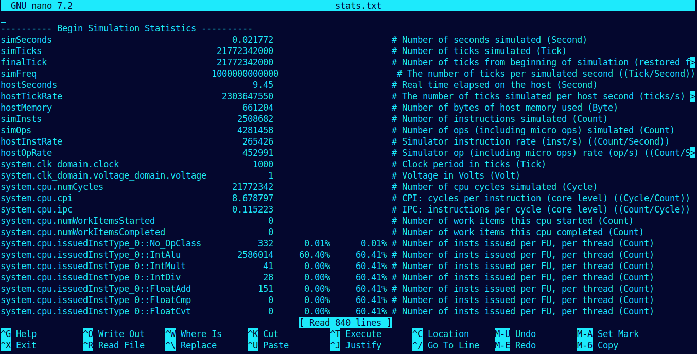
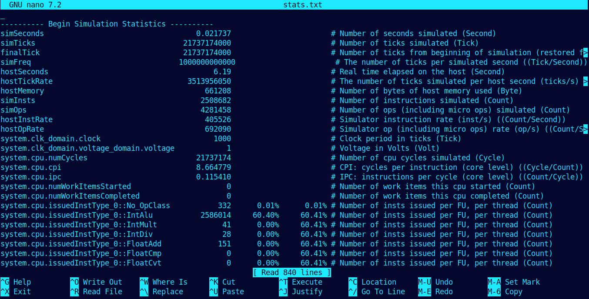
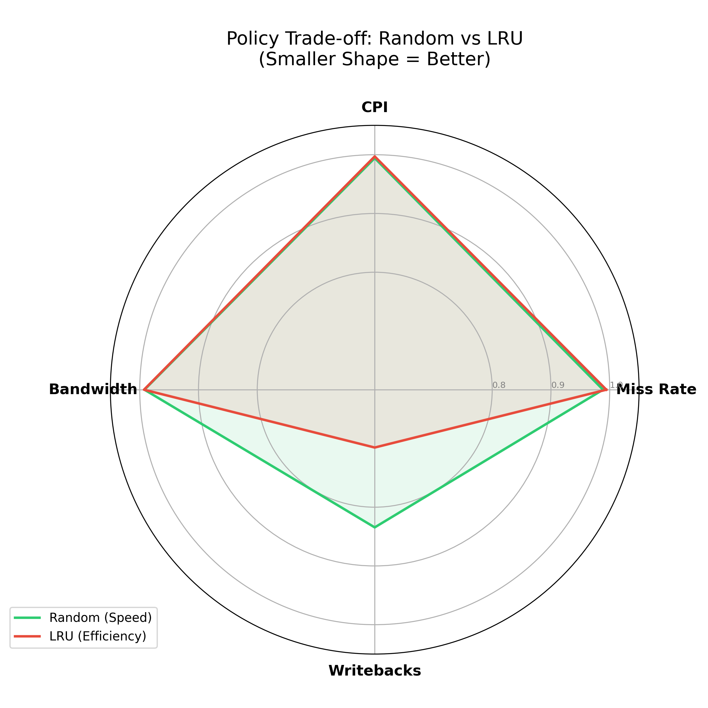
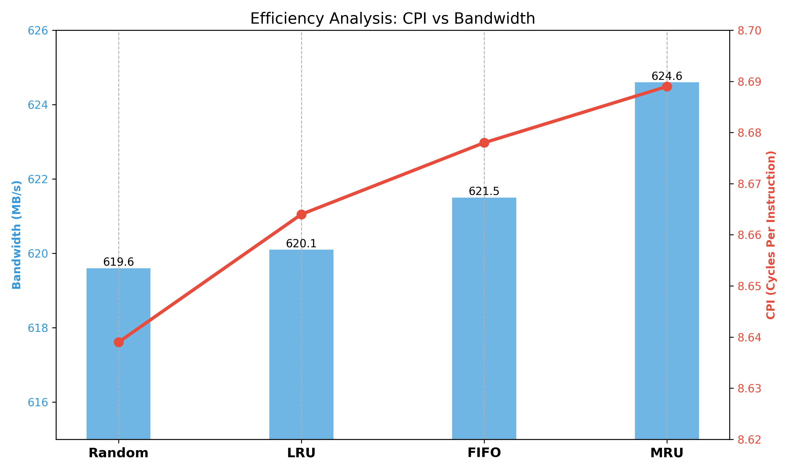

# Cache Replacement Analysis with gem5

A comparative analysis of **LRU, FIFO, Random, and MRU** cache replacement policies using the **gem5 simulator**.

## 📂 Files
* `run_cache.py`: Custom gem5 configuration script (32KB L1 Data Cache).
* `workload.c`: Synthetic C benchmark (128KB array linear scan).
* `plot_results.py`: Python script to generate performance graphs.
* `plots.py`: Python script to generate performance graphs.
* `FIFO`
* `LRU`
* `Plots`
* `MRU`
* `Random`
* `Report`
* `Screenshots`

## Usage

### 1. Compile Workload
```bash
gcc -O0 -static -o workload workload.c

```
### 2. Run Simulations
Execute the following commands to simulate each policy:

```bash
# Replace ~/gem5 with your installation path
~/gem5/build/X86/gem5.opt --outdir=m5out/LRU run_cache.py --policy LRU
~/gem5/build/X86/gem5.opt --outdir=m5out/FIFO run_cache.py --policy FIFO
~/gem5/build/X86/gem5.opt --outdir=m5out/Random run_cache.py --policy Random
~/gem5/build/X86/gem5.opt --outdir=m5out/MRU run_cache.py --policy MRU
```
### 3. Screenshots

<div align = "center">



</div>

### 4. Generate Graphs
```bash
#  Results Summary
Policy |	Miss Rate |	CPI (Efficiency) |	Bandwidth | Writebacks
Random |	12.19%    |	8.639            |	~619 MB/s |	2670
LRU	   |    12.26%	  | 8.665	         | ~620 MB/s  | 2235
FIFO   |    12.29%	  | 8.679	         | ~621 MB/s  | 2643
MRU	   |    12.33%	  | 8.689	         | ~624 MB/s  | 3200

```
### 5. Plots

<div align = "center">



</div>

### 6. Key Findings:

- Random achieved the fastest execution (lowest CPI) and lowest total bandwidth usage.

- LRU was the most energy-efficient for writes, generating the fewest writebacks to main memory.

- MRU performed the worst across all metrics for this sequential workload.

## Final Verdict

This project reveals a fascinating **Efficiency Paradox**:

* **⚡ Speed King:** **Random Replacement** proved that in massive looping workloads, "dumb" luck beats "smart" history. It delivered the **lowest CPI (8.639)** and least total memory pressure.
* **🔋 Battery Savior:** **LRU** remains the champion of write efficiency. By generating **16% fewer writebacks** than Random, it is the superior choice for minimizing costly writes to main memory.

**Takeaway:** If you want raw throughput, go **Random**. If you want to save energy, stick with **LRU**.